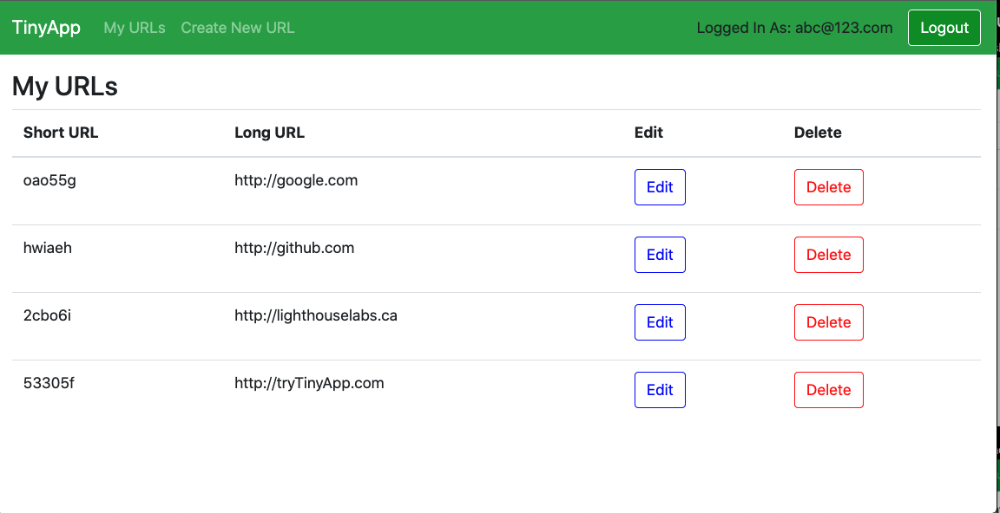
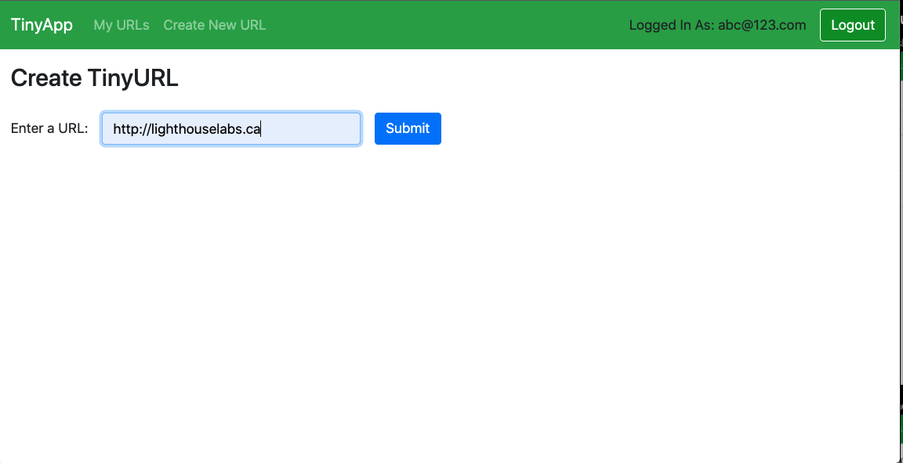
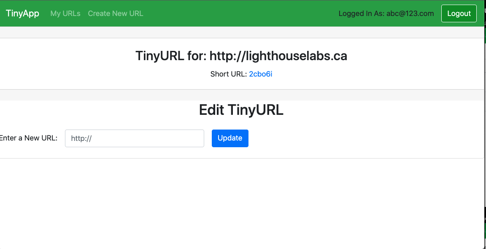

# TinyApp Project

TinyApp is a full stack web application built with Node and Express that allows users to shorten long URLs (à la bit.ly).

## TinyApp Features
* Register or login into your own personal account
* Your shortened URLs are yours - no one else has access to them
* Add, edit, or delete your URLs

Store all your shortened URLs in one convenient place.

Create new shortened URLs to your favourite sites.

Update your links as you discover new sites of interest.

## Dependencies

- Node.js
- Express
- EJS
- bcrypt
- body-parser
- cookie-session

## Getting Started

- Install all dependencies (using the `npm install` command).
- Run the development web server using the `node express_server.js` command.
